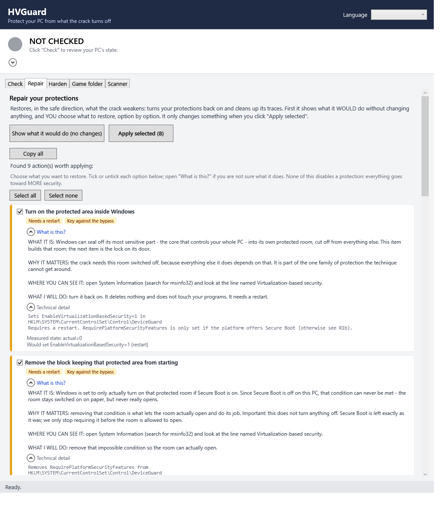
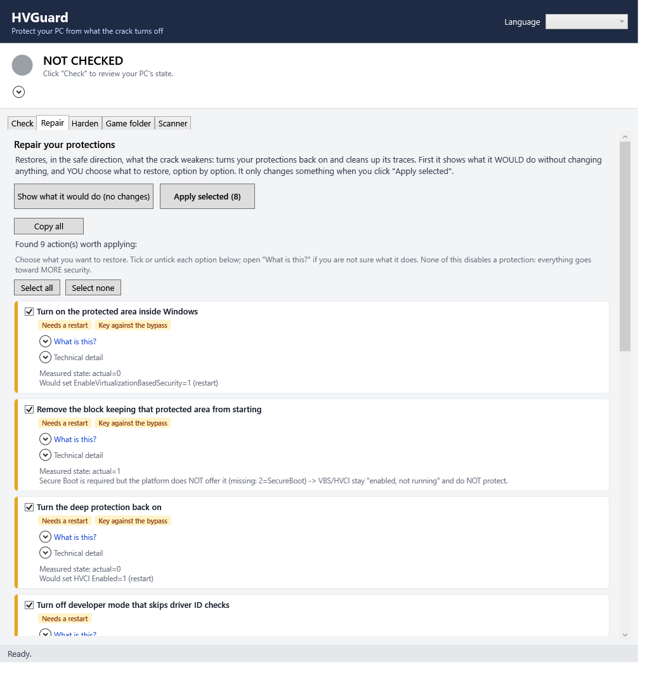
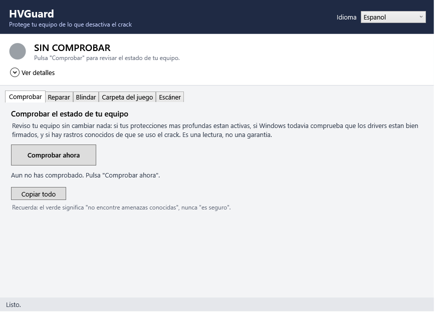

# HVGuard

*Puts back the Windows security protections a hypervisor-based DRM bypass turns off.*

HVGuard is for two audiences: people who ran, or think they ran, one of these cracks and want to
know what it changed on their PC and undo it, and defenders or researchers who want the analysis
and detection content behind it.

## What this is not

- Contains no bypass, crack, or DRM-circumvention code, in source or binary form.
- Distributes no game files, installers, or disc images.
- Contains no download links, mirrors, or magnet links — for the bypass or for anything else.
- Not an antivirus, and does not scan for general malware — only for this one technique's footprint.

## Two lanes

**"My PC — fix it."** Grab the latest release below, double-click it, and follow the five steps in
**"If you just want to fix your PC"**.

**"I'm a defender / researcher."** Start with the analysis and indicators of compromise (IOCs) in
[`docs/`](docs/), the Sigma/YARA content in [`defense/telemetry/`](defense/telemetry/), and the
PowerShell suite in [`defense/`](defense/) — see **"For defenders and researchers"** below.

## If you just want to fix your PC

No PowerShell and no jargon required — HVGuard is a single Windows program.

1. Go to the [Releases](../../releases) page and download `HVGuard.exe` from the latest release.
   It is a single file: no installer, nothing else to download, no internet connection needed once
   you have it.
2. Before you run it: Windows SmartScreen will most likely show a "Windows protected your PC"
   warning. That is expected, not a sign of tampering — HVGuard is not code-signed yet. Verify it
   anyway: check the file's SHA-256 (in PowerShell, `Get-FileHash .\HVGuard.exe -Algorithm SHA256`)
   against the checksum published with that release before you click "More info -> Run anyway."
3. Double-click `HVGuard.exe` and accept the Administrator prompt. It needs admin rights because
   repairing anything here means editing kernel-level settings (the Device Guard registry, boot
   configuration) that only an administrator can change. Cancel the prompt and HVGuard still opens,
   just read-only: Check and Analyze work, Repair and Harden are disabled.
4. Open **Check** to see where you stand, then **Repair** to preview what it would do. Nothing
   changes yet — tick the boxes for what you want restored (all ticked by default) and click Apply.
5. Restart when it tells you to. Most of these fixes only take effect after a reboot. Open
   **Check** again afterwards to confirm you are back to green.

> One thing no software can do for you: HVGuard cannot turn Secure Boot back on. That switch lives
> in your PC's firmware, not in Windows — Windows can read its state but never write it. Turning it
> on means a manual trip into your BIOS/UEFI setup screen. If your disk is BitLocker-encrypted,
> flipping that switch changes the boot measurement BitLocker checks, so be ready for it to ask for
> your recovery key on the next start; back that key up first.

## What it actually changes

HVGuard runs as Administrator and edits security settings that live in the Windows kernel's own
configuration. Exactly what it touches should not be a mystery — this table is drawn directly from
`defense/T5-remediation.ps1`, the script that does the work, step by step (R1-R9).

| Setting | Typical weakened value | What HVGuard sets | Effect |
|---|---|---|---|
| Virtualization-based security (VBS) — `EnableVirtualizationBasedSecurity` (`HKLM\SYSTEM\CurrentControlSet\Control\DeviceGuard`) | Off (0), or not set | 1 (On) | Turns on the walled-off memory region that Memory integrity needs in order to run at all. Needs a restart. |
| VBS startup prerequisite — `RequirePlatformSecurityFeatures` (same key) | Requires Secure Boot on a PC where Secure Boot is off, so VBS is stuck reporting "enabled, not running" | Removed, or lowered so only the properties your hardware actually offers are required | Lets VBS/Memory integrity actually start, without touching Secure Boot itself. Needs a restart. |
| Memory integrity, aka Hypervisor-enforced Code Integrity (HVCI) — `Enabled` (`...\DeviceGuard\Scenarios\HypervisorEnforcedCodeIntegrity`) | Off (0) | 1 (On) | Re-arms the one protection this bypass family cannot get around. Needs a restart. |
| `testsigning` (Boot Configuration Data, BCD) | On | Off | Closes the developer-mode hole that lets an unsigned driver load. Needs a restart. |
| `nointegritychecks` (BCD) | On — an alternate way some variants skip driver-signature checks entirely | Off | Closes that second BCD switch too. Needs a restart. |
| `hypervisorlaunchtype` (BCD) | Off | Auto | Lets Windows's own hypervisor start at all — without this, VBS/HVCI cannot run even if switched on. Needs a restart. |
| `HKLM\SOFTWARE\ManageVBS` (the crack's own tracking key) | Present | Removed | Deletes the marker the crack's script uses to remember what it turned off. Immediate, no restart. |
| Residual driver service (name allowlist: SimpleSvm, hyperkd, hyperhv, hyperevade) | Registered as a Windows service | Quarantined (`start=disabled`, file left intact) by default; deleted only if you explicitly opt in | Stops the leftover driver from loading again. Skipped if it is currently running, to avoid crashing your PC — reboot and re-run instead. |
| Secure Boot | Off | Not changed — HVGuard only reports its state and points you to your firmware setup | Windows can read this but never write it. See the callout above. |
| Microsoft's vulnerable driver blocklist — `VulnerableDriverBlocklistEnable` (`HKLM\...\CI\Config`) | Off (0) — often just Windows's default, not something this crack specifically flips | 1 (On) | Blocks the broader "bring your own vulnerable driver" (BYOVD) attack class this bypass belongs to. Needs a restart. |
| Leftover crack files (exact-name match only, e.g. `SimpleSvm.sys`, `VBS.cmd`, `DenuvOwO.nfo`) under Temp, Downloads, Desktop, `%ProgramData%` | Present | Deleted | Removes evidence and, in the case of the driver file itself, the thing that would otherwise be reloaded. Immediate. |

Every row above is its own checkbox, ticked by default. Untick any of them and HVGuard leaves that
setting alone: `-Only` is a fail-closed allowlist, so the engine only touches what you selected and
reports everything you left unticked as skipped, rather than quietly applying it anyway.

## What it cannot do

HVGuard is built to never overstate what it found. Three limits worth knowing before you rely on it:

- Green means "no known threats found." It never means "safe" — there is no way to prove a
  negative, and HVGuard's own status light says so on purpose.
- While the bypass's hypervisor is actually loaded, its entire point is to sit at Ring -1, below the
  kernel and below any antivirus — invisible from Windows user mode, which is where HVGuard itself
  runs. So the leverage here is not "watch it happen": it is closing the two doors the technique
  needs (Memory integrity, driver-signature enforcement) so the load fails in the first place, and
  reading the traces an attempt leaves behind, before and after.
- A pre-install scan reads a file; it does not run it. If an installer's payload is packed or
  encrypted, whatever is inside stays invisible to that scan until it is actually unpacked — a clean
  scan of an installer is not a guarantee about what that installer will drop once it runs.

## For defenders and researchers

### Analysis and documentation

| Doc | Contents |
|---|---|
| [`docs/01-technical-dossier.md`](docs/01-technical-dossier.md) | Bypass mechanics: VT-x/AMD-V, Ring -1, Extended/Nested Page Tables (EPT/NPT), CPUID/MSR spoofing, syscall hooks, and the specifics of the DenuvOwO component. |
| [`docs/02-iocs-and-load-chain.md`](docs/02-iocs-and-load-chain.md) | Component inventory, IOCs, registry keys, load procedure, verification commands. |
| [`docs/03-analysis-methodology.md`](docs/03-analysis-methodology.md) | The safe, static-analysis-only environment and runbook (radare2, pefile, capstone, diffing against upstreams). |
| [`docs/04-defensive-tools-spec.md`](docs/04-defensive-tools-spec.md) | Roadmap and specification for the tools: detection, repair, hardening. |
| [`docs/05-sources-and-references.md`](docs/05-sources-and-references.md) | Research sources, and the clean-source study material behind the analysis. |
| [`docs/06-hvguard-design.md`](docs/06-hvguard-design.md) | HVGuard's own design and execution plan. |

### The defensive suite (T0-T7)

Independent, idempotent PowerShell scripts in [`defense/`](defense/). Anything that changes state
is dry-run or audit by default, all of them print human-readable and JSON output
(`-AsJson`/`-JsonPath`), and every one of them only ever moves the system toward more security —
none can disable a protection or load a driver. Full quality bar in `defense/README.md`.

| ID | Script | What it does | Touches the system? |
|---|---|---|---|
| T0 / T6 | `T0-hv-detector.ps1` | Detects an unexplained hypervisor running right now, or its traces after it already ran and unloaded (`-PostExecution`). | No (read-only) |
| T1 | `T1-posture-check.ps1` | PASS/FAIL posture report: `testsigning`, `nointegritychecks`, VBS, HVCI, Secure Boot, the `ManageVBS` IOC, blocklist/Smart App Control. | No (read-only) |
| T2 | `T2-hvci-enforce-monitor.ps1` | Enforces HVCI/VBS and installs a scheduled task that alerts on drift. | Yes (`-Enforce` / `-InstallMonitor`) |
| T3 | `T3-wdac-block-unsigned-drivers.ps1` | Windows Defender Application Control (WDAC) policy that blocks unsigned drivers. | Yes (audit mode by default) |
| T4 | [`telemetry/`](defense/telemetry/) | Sysmon config, Sigma rules, and a YARA rule — detection content, not a script. | No |
| T5 | `T5-remediation.ps1` | Remediation: the table above, in script form. | Yes (dry-run by default) |
| T7 | `T7-target-scan.ps1` | Read-only known-threat scanner over a target file or folder — an installer before you run it, or an already-installed game folder. Backs HVGuard's Game folder and Scanner tabs. | No (read-only) |

Recommended deployment order (from `defense/README.md`):

1. **T1** — posture baseline; also your final check after everything else.
2. **T4** — telemetry (Sysmon + Sigma + YARA): immediate visibility, changes nothing.
3. **T2** `-Enforce` + `-InstallMonitor` — lock HVCI/VBS on, and get alerted if something turns them
   back off.
4. **T3** `-Audit` first, review what would be blocked, then `-Enforce`.
5. **T5** `-Apply` — only if a machine is already compromised: revert the weakened settings,
   restart, re-validate with T1.
6. **T0/T6** — on demand, for incident response or "did this already run here."

**T7** runs on demand at any point outside that sequence: against an installer before you run it,
or swept across an already-installed game folder.

### Detection content

[`defense/telemetry/`](defense/telemetry/) ships a Sysmon config fragment, six Sigma rules, and a
YARA rule, built from public IOCs and the studied upstream projects — never from the bypass binary
itself. See `defense/telemetry/README.md` for deployment commands (`sigma convert`,
`sysmon64.exe -c`, `yara -r`) and the event-ID mapping.

## How the technique works

The technique places a thin hypervisor underneath a Windows session that is already running — the
"Blue Pill" idea: turning the running OS into a guest without it noticing, instead of booting a
fresh virtual machine. From Ring -1, below the kernel and below any antivirus, it intercepts the
`CPUID` instruction and model-specific-register (MSR) reads that the DRM's anti-tamper checks use to
fingerprint the machine, and returns the values the game was originally licensed against. It also
uses second-level page tables (Extended/Nested Page Tables, EPT/NPT) to serve different bytes to a
read than to an execution of the same address, so an integrity check reads clean, original code
while the CPU actually executes a patched version. The DRM's own code is never modified or
reverse-engineered; it is deceived from underneath.

Getting that hypervisor loaded needs exactly the posture this project defends against: hardware
virtualization on, Secure Boot off, and driver-signature enforcement relaxed for one boot or
persistently, so an unsigned kernel driver can start. Independent analyses agree the component built
for this is not general-purpose malware — no command-and-control, no exfiltration — but it is not
risk-free either: its own virtual-machine-monitor component has a documented flaw exploitable from
any unprivileged process while it is loaded, and Memory integrity (HVCI) — the one control enforced
from entirely outside Windows — is the piece it cannot defeat. None of it is persistent: the driver
unloads when the game closes, and Windows re-arms driver signing on the very next boot regardless of
what anyone does. What is left behind afterwards is exactly the footprint this project's tools are
built to find and reverse.

Full write-up, with the component inventory and load procedure: [`docs/01-technical-dossier.md`](docs/01-technical-dossier.md).

## Bilingual by design

HVGuard's interface, and the analysis behind it, exist in English and Spanish side by side — this
is a global piracy scene, and fluent English should not be a precondition for putting your
protections back on. Every user-facing string ships in both `launcher/lib/i18n/en.psd1` and
`es.psd1` before it is considered done.

## License, warranty, and credits

Apache License 2.0 — see [`LICENSE`](LICENSE) and [`NOTICE`](NOTICE). As with any Apache-2.0 work,
this is provided "AS IS", without warranties or conditions of any kind — see the Disclaimer of
Warranty in `LICENSE` for the exact terms. Found a bug, especially a security-relevant one? See
[`SECURITY.md`](SECURITY.md). Ran into a term you don't recognize? See [`GLOSSARY.md`](GLOSSARY.md).

This project studies, and credits by name, the open-source projects the analyzed bypass is built on
top of. None of their code is vendored — see `NOTICE` for exactly what that means for each:

- **SimpleSvm** — Satoshi Tanda. A minimal, educational AMD-V hypervisor; the bypass's own driver is
  derived from it.
- **HyperDbg** — Sina Karvandi. A hypervisor-assisted debugger; the bypass's core VMM component is
  reported to be based on it.
- **EfiGuard** — Mattiwatti. A UEFI bootkit that disables PatchGuard and driver signature
  enforcement; present in sibling releases of the same crack family, not present in the flow
  analyzed here.
